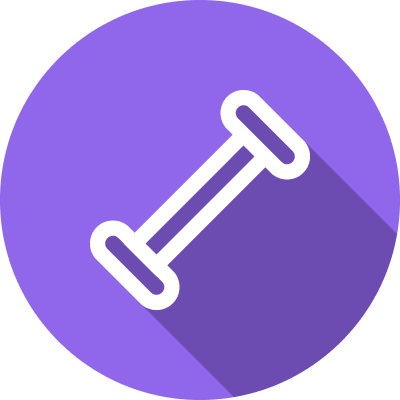
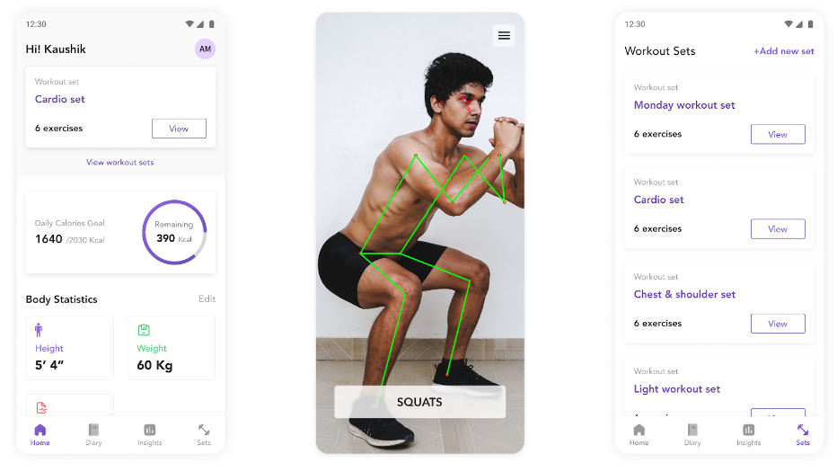

<!-- PROJECT LOGO -->
 

  

  <h3 align="center">FitWave</h3>

<!-- ABOUT THE PROJECT -->
## About The Project

Fitwave is a flutter mobile application that aims to serve as a complete fitness partner. We utilize Movenet, a pose estimation model developed by Tensorflow to extract poses from the video camera feed in real-time. Using these extracted keypoints, the app monitors the posture of the user and visually indicates incorrect form.

#### Additional features:

- Calorie counter
- Workout planner

### Built With

* [Flutter](https://flutter.dev/)
* [Django](https://www.djangoproject.com/)
* [Tensorflow (Lite)](https://www.tensorflow.org/)
* [Firebase](https://firebase.google.com/)
* [PostgreSQL](https://www.postgresql.org/)

## Usage

1. migrate
2. Import assets/data_import/exercisedata.csv to table: workout_exercisedata
2. Import assets/data_import/fooddata.csv to table: calorieTracker_fooddata

<!-- CONTRIBUTING -->
## Contributing

We are looking for ways to improve this project through optimizations or new features. Here's how you can contribute to FitWave:

1. Fork the Project
2. Create your Feature Branch (`git checkout -b feature/AmazingFeature`)
3. Commit your Changes (`git commit -m 'Add some AmazingFeature'`)
4. Push to the Branch (`git push origin feature/AmazingFeature`)
5. Open a Pull Request
